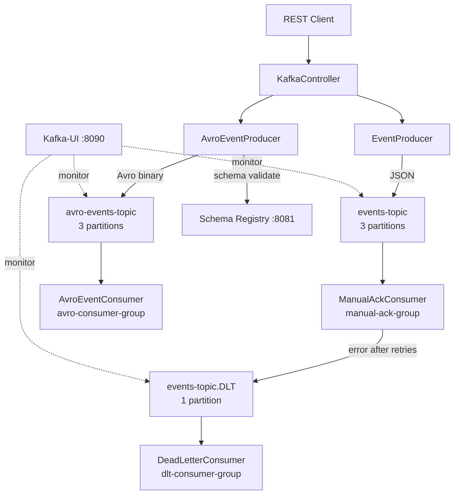

# Apache Kafka Learning — Spring Microservices Edition

!!! tip "What is this?"
    A **progressive, hands-on learning guide** to Apache Kafka, built around a real Spring Boot project that demonstrates every major Kafka pattern you'll encounter in production microservices.


## What's Covered in This Project

The Spring Boot application in this repository demonstrates:

| #  | Concept                             | Spring Class                                                    |
|:---|:------------------------------------|:----------------------------------------------------------------|
| 1  | JSON event publishing               | `EventProducer`                                                 |
| 2  | Manual-acknowledge consumer         | `ManualAckConsumer`                                             |
| 3  | Dead Letter Topic + offset deletion | `DeadLetterConsumer`                                            |
| 4  | Exponential backoff retry           | `KafkaConfig.errorHandler()`                                    |
| 5  | Avro schema + Schema Registry       | `AvroEventProducer` / `AvroEventConsumer`                       |
| 6  | Multiple consumer groups            | `manual-ack-group`, `dlt-consumer-group`, `avro-consumer-group` |
| 7  | Custom exception taxonomy           | `CustomErrorHandler`                                            |
| 8  | REST-driven produce/consume         | `KafkaController`                                               |

## Quick Start (3 commands)

```bash
# 1. Start infrastructure
docker compose up -d

# 2. Start the Spring Boot app
./mvnw spring-boot:run

# 3. Send your first event
curl -s -X POST "http://localhost:8080/api/kafka/events/test?eventType=ORDER_CREATED" | jq
```

Open **Kafka-UI** at [http://localhost:8090](http://localhost:8090) to see the message arrive in real time.

---

## Architecture at a Glance



