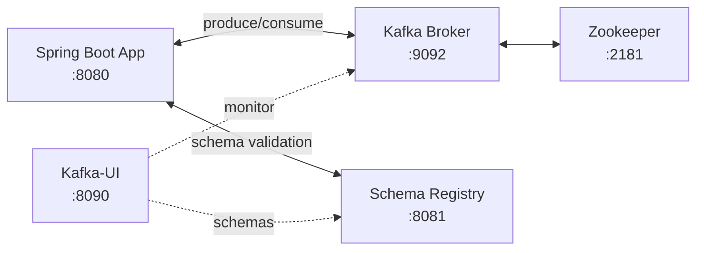

# Environment Setup

Everything in this guide runs on **Docker**. No local Kafka or Zookeeper installation needed.

---

## Prerequisites

| Tool | Minimum Version | Notes |
|------|----------------|-------|
| Java | 24 | `JAVA_HOME` must point to JDK 24 |
| Maven | 3.9+ | Or use the included `./mvnw` wrapper |
| Docker | 24+ | Docker Desktop on macOS |
| Docker Compose | v2+ | Bundled with Docker Desktop |
| `jq` | any | `brew install jq` — pretty-prints JSON responses |
| `curl` | any | Pre-installed on macOS |

---

## Infrastructure Overview



| Container | Image | Host Port | Purpose |
|-----------|-------|-----------|---------|
| `zookeeper` | `confluentinc/cp-zookeeper:7.5.0` | 2181 | Kafka coordination |
| `kafka` | `confluentinc/cp-kafka:7.5.0` | 9092 (host) / 29092 (internal) | Message broker |
| `schema-registry` | `confluentinc/cp-schema-registry:7.5.0` | 8081 | Avro schema store & validator |
| `kafka-ui` | `provectuslabs/kafka-ui:latest` | 8090 | Web monitoring UI |

---

## Step 1 — Start Infrastructure

```bash
cd /path/to/Kafka-Learning

# Start all containers in the background
docker compose up -d
```

Expected output:
```
✔ Container zookeeper       Started
✔ Container kafka           Started
✔ Container schema-registry Started
✔ Container kafka-ui        Started
```

---

## Step 2 — Wait for Kafka to Be Ready

Kafka takes ~15–30 seconds after Docker reports it running:

```bash
# Block until the broker log confirms readiness
docker logs -f kafka 2>&1 | grep -m1 "started (kafka.server.KafkaServer)"
```

You'll see:
```
[KafkaServer id=1] started (kafka.server.KafkaServer)
```
Press `Ctrl+C` once it appears.

**Quick health-check alternative:**
```bash
docker exec kafka kafka-topics --bootstrap-server localhost:9092 --list
# Returns (even empty) without error = Kafka is ready
```

**Verify Schema Registry:**
```bash
curl -s http://localhost:8081/subjects
# Expected: []
```

---

## Step 3 — (Optional) Pre-create Topics

Spring Boot auto-creates topics via `KafkaConfig`, but doing it manually avoids race conditions on slow machines:

```bash
docker exec kafka kafka-topics \
  --bootstrap-server localhost:9092 --create --if-not-exists \
  --topic events-topic --partitions 3 --replication-factor 1

docker exec kafka kafka-topics \
  --bootstrap-server localhost:9092 --create --if-not-exists \
  --topic events-topic.DLT --partitions 1 --replication-factor 1

docker exec kafka kafka-topics \
  --bootstrap-server localhost:9092 --create --if-not-exists \
  --topic avro-events-topic --partitions 3 --replication-factor 1
```

Confirm:
```bash
docker exec kafka kafka-topics --bootstrap-server localhost:9092 --list
```

---

## Step 4 — Start the Spring Boot App

```bash
./mvnw spring-boot:run
```

Look for:
```
Started KafkaOffsetDemoApplication in X.XXX seconds
```

The app runs on **port 8080**.

---

## Step 5 — Verify in Kafka-UI

Open **[http://localhost:8090](http://localhost:8090)**

- **Topics** → `events-topic` (3 partitions), `events-topic.DLT`, `avro-events-topic`
- **Consumers** → `manual-ack-group`, `dlt-consumer-group`, `avro-consumer-group`
- **Schema Registry** → appears after first Avro event

---

## Shutdown

```bash
# Stop the app
Ctrl+C

# Stop containers (keep data)
docker compose stop

# Stop and remove containers + networks
docker compose down

# Full wipe (removes Kafka data volumes too)
docker compose down -v
```

---

## Troubleshooting

??? failure "App fails to start — Kafka connection refused"
    Kafka wasn't ready.

    ```bash
    docker compose up -d
    # Wait 30s, then:
    docker exec kafka kafka-topics --bootstrap-server localhost:9092 --list
    ./mvnw spring-boot:run
    ```

??? failure "Schema Registry refused — Avro send fails"
    ```bash
    curl -s http://localhost:8081/subjects
    docker compose up -d schema-registry
    docker logs schema-registry
    ```

??? failure "Port 9092 already in use"
    ```bash
    lsof -i :9092
    ```
    Stop the conflicting process or change the port in `docker-compose.yml`.

