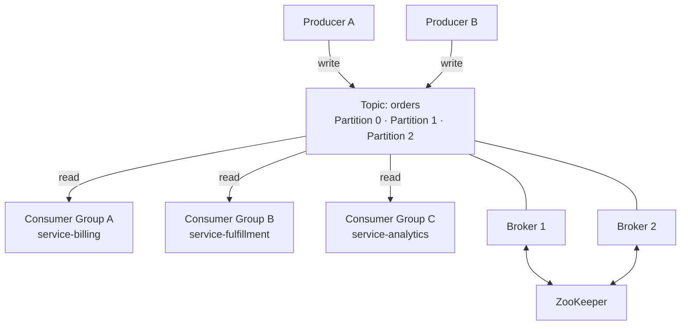
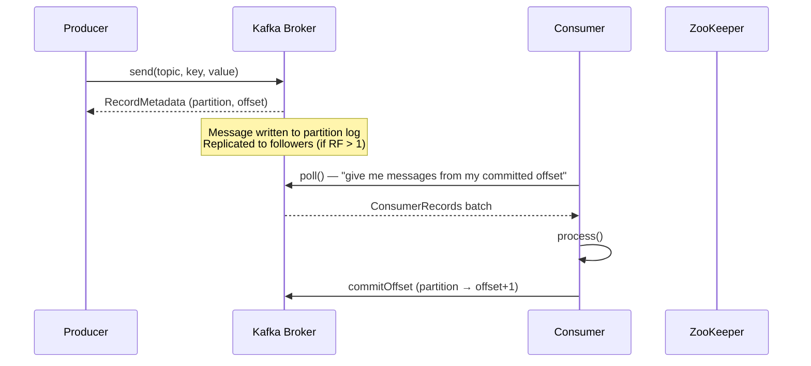

# 01 · Kafka Fundamentals

!!! abstract "Learning Objectives"
    After this module you will be able to:

    - Explain the core components of a Kafka cluster
    - Describe how messages flow from producer to consumer
    - Distinguish Kafka's log-based model from traditional message queues
    - Explain partitions, offsets, and consumer groups

---

## What is Apache Kafka?

Apache Kafka is a **distributed commit-log platform** designed for high-throughput, fault-tolerant, real-time data streaming. It can serve as:

- A **message bus** — point-to-point or pub/sub messaging
- An **event streaming platform** — durable ordered event log
- A **data pipeline** — connecting microservices and data systems

> Unlike traditional queues (RabbitMQ, ActiveMQ), Kafka messages are **not deleted after consumption**. They are retained for a configurable period, allowing multiple consumers and historical replay.

---

## Core Components



### Broker

A Kafka **broker** is a server that:

- Receives messages from producers and stores them on disk
- Serves messages to consumers on request
- Participates in a **cluster** alongside other brokers

In this project, the broker runs in the `kafka` Docker container and is accessible at:

- `localhost:9092` — from your host machine (Spring Boot app)
- `kafka:29092` — from other Docker containers (Schema Registry, Kafka-UI)

### Topic

A **topic** is a named, ordered log of messages. Think of it as a table in a database or a folder of log files.

This project uses three topics:

| Topic | Partitions | Purpose |
|-------|-----------|---------|
| `events-topic` | 3 | Main JSON event stream |
| `events-topic.DLT` | 1 | Dead-letter (failed events) |
| `avro-events-topic` | 3 | Avro schema-validated stream |

### Partition

Each topic is split into **partitions** — independent ordered sub-logs:

```
events-topic
├── Partition 0: [msg@0] [msg@1] [msg@5] ...
├── Partition 1: [msg@0] [msg@2] [msg@6] ...
└── Partition 2: [msg@0] [msg@3] [msg@7] ...
```

Key facts:

- Messages within a partition are **strictly ordered**
- A message with the same key **always goes to the same partition** (key hashing)
- Partitions enable **horizontal scalability** — more partitions = more parallelism
- Each partition is assigned to **one consumer** per consumer group at any time

### Offset

An **offset** is a unique, monotonically increasing integer identifying a message within a partition:

```
Partition 0: [offset=0 | msg] [offset=1 | msg] [offset=2 | msg] → next write: offset=3
```

Offsets are per-partition and are committed by consumers to track progress.

In `ManualAckConsumer`:
```java
@KafkaListener(topics = "${kafka.topics.main}", groupId = "manual-ack-group")
public void consume(
        @Payload Event event,
        @Header(KafkaHeaders.RECEIVED_PARTITION) int partition,
        @Header(KafkaHeaders.OFFSET) long offset,  // (1)!
        Acknowledgment ack) {
    // ...
    ack.acknowledge(); // commits this offset (2)!
}
```

1. The offset is read from the Kafka message header.
2. `ack.acknowledge()` tells Kafka: "I've processed this message, advance my committed offset."

---

## Message Lifecycle



---

## Kafka vs Traditional Queue

| Feature | Traditional Queue (RabbitMQ) | Kafka |
|---------|------------------------------|-------|
| Storage | In-memory / transient | Durable disk-based log |
| Deletion | After consumption (ACK) | Retention policy (time / size) |
| Replay | ❌ Not possible | ✅ Reset offset to replay |
| Multiple consumers | Competing consumers (one gets it) | All consumer groups get a copy |
| Ordering | Per-queue | Per-partition |
| Throughput | Moderate | Very high (millions/sec) |
| Use case | Task queues, RPC | Event sourcing, streaming, audit log |

---

## Retention Policy

Messages are retained by time OR size (whichever is reached first):

```properties
# Keep messages for 7 days (default)
log.retention.hours=168

# Keep max 1 GB per partition
log.retention.bytes=1073741824
```

!!! info "This project"
    The Confluent Docker image uses **default retention** (7 days). Messages accumulate until you run `docker compose down -v`.

---

## Consumer Groups

A **consumer group** is a logical grouping of consumer instances that together consume a topic:

```
events-topic (3 partitions)
├── Partition 0 ──► Consumer 1 (manual-ack-group)
├── Partition 1 ──► Consumer 2 (manual-ack-group)
└── Partition 2 ──► Consumer 3 (manual-ack-group)
```

Rules:
- Each partition is consumed by **exactly one** member of a group
- If consumers > partitions, excess consumers sit idle
- If consumers < partitions, some consumers handle multiple partitions
- **Different groups** each get their own independent copy of all messages

This project has **three consumer groups**:

| Group | Consumer Class | Topic |
|-------|---------------|-------|
| `manual-ack-group` | `ManualAckConsumer` | `events-topic` |
| `dlt-consumer-group` | `DeadLetterConsumer` | `events-topic.DLT` |
| `avro-consumer-group` | `AvroEventConsumer` | `avro-events-topic` |

---

## Key Takeaways

!!! success "What to remember"
    1. Kafka is a **distributed, durable, ordered log** — not a queue
    2. Topics are split into **partitions** for scalability
    3. Each message has an **offset** (unique position within a partition)
    4. Consumer groups allow **multiple independent reads** of the same topic
    5. Messages are **retained** regardless of consumption — replay is possible

---

## Up Next

➡️ [02 · Spring Kafka Setup](02-spring-kafka-setup.md) — how to wire Kafka into your Spring Boot application.

**Hands-on now?** → [Lab 01 · Docker Setup](../labs/lab-01-docker-setup.md)

