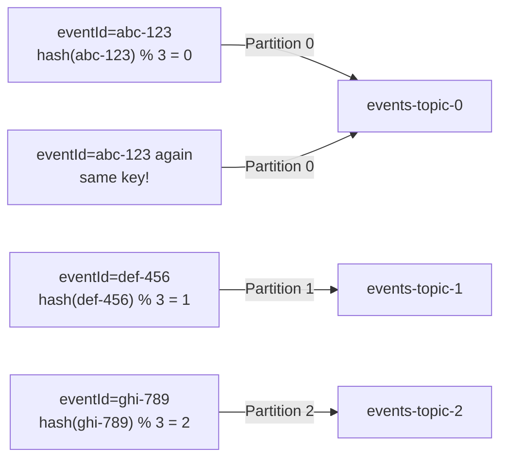
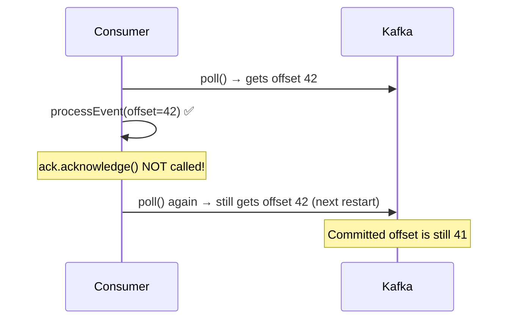

# 03 · Producers & Consumers

!!! abstract "Learning Objectives"
    - Understand how `EventProducer` publishes JSON events
    - Understand how `ManualAckConsumer` reads and acknowledges messages
    - Explain partitioning by key
    - Compare `AckMode` options and when to use each

---

## The Producer Side

### EventProducer

```java title="producer/EventProducer.java"
@Service
@Slf4j
@RequiredArgsConstructor
public class EventProducer {
    private final KafkaTemplate<String, Object> kafkaTemplate;

    @Value("${kafka.topics.main}")
    private String mainTopic;

    public Event sendEvent(Event event) {
        kafkaTemplate.send(mainTopic, event.getEventId(), event); // (1)!
        log.info("Sent event: {}", event.getEventId());
        return event;
    }

    public Event createAndSendTestEvent(String eventType,
                                        boolean simulateError,
                                        Event.ErrorType errorType) {
        Event event = Event.builder()
                .eventId(UUID.randomUUID().toString()) // (2)!
                .eventType(eventType)
                .payload("Test payload")
                .timestamp(LocalDateTime.now())
                .simulateError(simulateError)
                .errorType(errorType)
                .build();
        return sendEvent(event);
    }
}
```

1. `send(topic, key, value)` — the **key** (`eventId`) determines the partition via consistent hashing: same key → same partition always.
2. A random UUID ensures each event lands on any partition (round-robin distribution across the key space).

### Partition Assignment by Key



!!! tip "Key design matters"
    If all events for the same order should be **processed in order**, use the **order ID** as the key. This guarantees they land on the same partition and are consumed sequentially.

### The Event Model

```java title="model/Event.java (structure)"
@Data
@Builder
public class Event {
    private String eventId;
    private String eventType;      // e.g. "ORDER_CREATED"
    private String payload;
    private LocalDateTime timestamp;
    private boolean simulateError;
    private ErrorType errorType;   // NONE | TRANSIENT | PERMANENT | VALIDATION

    public enum ErrorType {
        NONE, TRANSIENT, PERMANENT, VALIDATION
    }
}
```

---

## The Consumer Side

### ManualAckConsumer

```java title="consumer/ManualAckConsumer.java"
@Component
@Slf4j
@RequiredArgsConstructor
public class ManualAckConsumer {
    private final EventProcessingService processingService;

    @KafkaListener(topics = "${kafka.topics.main}", groupId = "manual-ack-group")
    public void consume(
            @Payload Event event,
            @Header(KafkaHeaders.RECEIVED_PARTITION) int partition,
            @Header(KafkaHeaders.OFFSET) long offset,
            Acknowledgment ack) {

        log.info("Received - Partition: {}, Offset: {}, EventId: {}",
                 partition, offset, event.getEventId());
        try {
            processingService.processEvent(event);  // (1)!
            ack.acknowledge();                       // (2)!
            log.info("Acknowledged offset: {}", offset);
        } catch (CustomErrorHandler.TransientException e) {
            log.warn("Transient error, will retry. Offset: {}", offset);
            throw e; // (3)!
        } catch (Exception e) {
            log.error("Error at offset {}: {}", offset, e.getMessage());
            throw e; // (4)!
        }
    }
}
```

1. All business logic is in `EventProcessingService` — the consumer stays lean.
2. **Only called on success.** The offset is committed to Kafka immediately.
3. Re-throwing lets `DefaultErrorHandler` handle the retry + DLT logic.
4. Same for permanent/validation errors — they bubble up to the error handler.

---

## AckMode — When is the Offset Committed?

| AckMode | Who commits | When | Used In This Project |
|---------|-------------|------|---------------------|
| `AUTO` (default) | Spring | After listener method returns normally | ❌ |
| `RECORD` | Spring | After each record processed | ❌ |
| `BATCH` | Spring | After all records in a poll batch | ❌ |
| `MANUAL` | Developer | When `ack.acknowledge()` is called; batched until next poll | ❌ |
| **`MANUAL_IMMEDIATE`** | Developer | **Immediately** when `ack.acknowledge()` is called | ✅ |
| `COUNT` | Spring | After N records processed | ❌ |
| `TIME` | Spring | After T milliseconds | ❌ |

### Why MANUAL_IMMEDIATE?

With `MANUAL_IMMEDIATE`:

```
Message consumed → Business logic runs → SUCCESS → ack.acknowledge() → offset committed NOW
                                       → FAILURE → throw exception  → offset NOT committed → retry
```

This ensures **at-least-once delivery** — if the app crashes after processing but before committing, the message will be re-processed on restart. This is the safest default for microservices.

### What Happens Without `ack.acknowledge()`?



Every restart re-processes the same message indefinitely → **infinite duplicates**.

---

## The Avro Producer

`AvroEventProducer` works the same way but uses the `avroKafkaTemplate` which has `KafkaAvroSerializer` configured:

```java title="producer/AvroEventProducer.java (key section)"
public AvroEvent createAndSendAvroEvent(String eventType, String payload,
                                         boolean simulateError, ErrorType errorType) {
    AvroEvent event = AvroEvent.newBuilder()  // (1)!
            .setEventId(UUID.randomUUID().toString())
            .setEventType(eventType)
            .setPayload(payload)
            .setTimestamp(Instant.now())
            .setSimulateError(simulateError)
            .setErrorType(errorType == null ? ErrorType.NONE : errorType)
            .build();
    avroKafkaTemplate.send(avroTopic, event.getEventId(), event); // (2)!
    return event;
}
```

1. `AvroEvent` is a **generated class** from `Event.avsc` — not hand-written.
2. `KafkaAvroSerializer` contacts Schema Registry, validates schema, then serialises to binary Avro format before the message reaches the broker.

---

## REST Controller Wiring

`KafkaController` exposes the produce functionality over HTTP:

```
POST /api/kafka/events              → EventProducer.sendEvent(body)
POST /api/kafka/events/test         → EventProducer.createAndSendTestEvent(params)
POST /api/kafka/avro/events         → AvroEventProducer.createAndSendAvroEvent(params)
```

This lets you trigger produce/consume flows with a simple `curl` command — no Kafka client tooling needed during development.

---

## Key Takeaways

!!! success "What to remember"
    1. `kafkaTemplate.send(topic, key, value)` — **key controls partitioning**
    2. Same key → same partition → **ordered processing** for related events
    3. `AckMode.MANUAL_IMMEDIATE` — you control exactly when the offset advances
    4. **Always re-throw** exceptions from consumers so the error handler can retry/DLT
    5. Avro producer and JSON producer are separate `KafkaTemplate` instances with different serialisers

---

## Up Next

➡️ [04 · Consumer Groups & Offsets](04-consumer-groups-and-offsets.md)

**Hands-on now?** → [Lab 02 · First Producer & Consumer](../labs/lab-02-first-producer-consumer.md)

