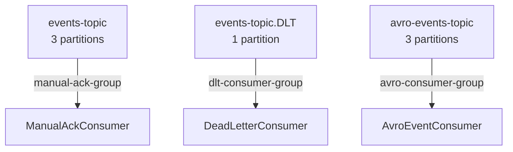
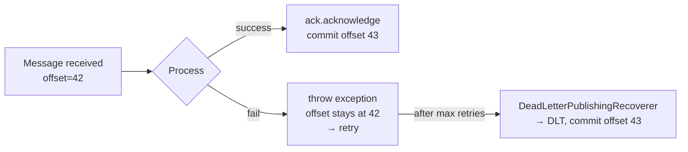
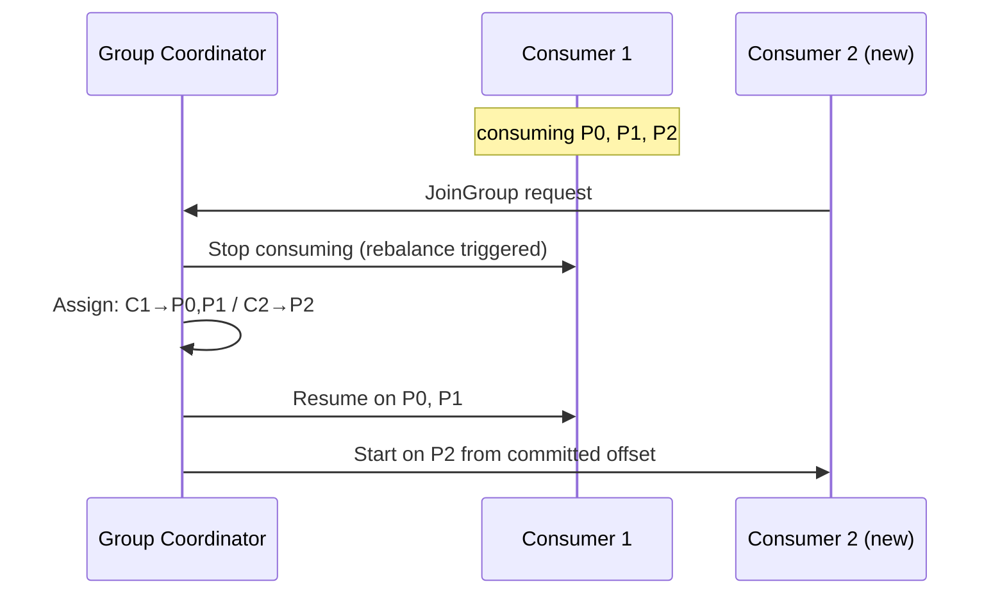

# Consumer Groups & Offsets (04)

!!! abstract "Learning Objectives"
    - Explain consumer group mechanics and partition assignment
    - Describe what happens during a group rebalance
    - Understand `auto.offset.reset` options
    - Compare offset commit strategies and their delivery guarantees

---

## Consumer Groups Recap

A **consumer group** allows multiple application instances to cooperate in consuming a topic:

```
events-topic (3 partitions)
┌─────────────┬─────────────┬─────────────┐
│ Partition 0 │ Partition 1 │ Partition 2 │
└──────┬──────┴──────┬──────┴──────┬──────┘
       │             │             │
   Instance A    Instance B    Instance C
   (manual-ack-group)
```

Rules:

- Each partition → **at most one** consumer in the group
- Excess consumers are **idle** (standby for failover)
- Each group tracks its own committed offsets **independently**
- Adding a new consumer group = full replay from the `auto.offset.reset` point

---

## The Three Groups in This Project



| Group | Topic | Purpose | Ack Mode |
|-------|-------|---------|----------|
| `manual-ack-group` | `events-topic` | Process business events | `MANUAL_IMMEDIATE` |
| `dlt-consumer-group` | `events-topic.DLT` | Log & delete failed events | `MANUAL_IMMEDIATE` |
| `avro-consumer-group` | `avro-events-topic` | Process Avro-encoded events | `MANUAL_IMMEDIATE` |

---

## auto.offset.reset

When a consumer group has **no committed offset** (new group, or offsets expired), Kafka uses `auto.offset.reset` to decide where to start reading:

| Value | Behaviour | When to Use |
|-------|-----------|-------------|
| `latest` ✅ (this project) | Start from messages produced **after** the consumer first connects | Production — skip historical backlog |
| `earliest` | Start from the **beginning** of each partition | Replay, initial data load, testing |
| `none` | Throw `NoOffsetForPartitionException` | Fail-fast in strict environments |

```java title="KafkaConfig.java"
props.put(ConsumerConfig.AUTO_OFFSET_RESET_CONFIG, "latest");
```

!!! warning "`latest` vs `earliest` — the gotcha"
    With `latest`, if your consumer group is created *after* messages were already published, those earlier messages are **invisible** to this group. Use `earliest` during development to see all messages from the start.

---

## Offset Commit Strategies



### enable.auto.commit = false (this project)

```java
props.put(ConsumerConfig.ENABLE_AUTO_COMMIT_CONFIG, false);
```

Spring controls the commit. Offset is committed **only** when `ack.acknowledge()` is called (with `MANUAL_IMMEDIATE`). This gives:

- **At-least-once delivery** — a message may be re-processed if the app crashes after processing but before commit
- **No silent data loss** — offset never advances past unprocessed messages

### enable.auto.commit = true (not used here)

Kafka commits offsets at a fixed interval (`auto.commit.interval.ms`). Simpler but:

- Messages may be committed **before** they're successfully processed → data loss on crash
- Messages may be re-processed if the app crashes between a commit interval → duplicates possible

---

## Rebalancing

A **rebalance** occurs when the group membership changes:

- A new consumer joins (scale-out)
- A consumer leaves or crashes
- Topics/partitions are added

During a rebalance:
1. All consumers in the group **stop consuming** (pause)
2. The **Group Coordinator** (a Kafka broker) reassigns partitions
3. Consumers **resume** from their committed offsets on the newly assigned partitions



!!! tip "Rebalance in practice"
    In this project you can trigger a rebalance by starting a **second instance** of the Spring Boot app. Watch Kafka-UI → `manual-ack-group` → the partition assignments change in real time.

---

## Lag — the Key Observability Metric

**Consumer lag** = (latest offset on partition) − (consumer's committed offset)

```
Partition 0: latest=100, committed=98 → lag=2
Partition 1: latest=50,  committed=50 → lag=0
Partition 2: latest=75,  committed=70 → lag=5

Total lag for manual-ack-group = 7
```

Zero lag = consumer is fully caught up.
High/growing lag = consumer is falling behind — scale out or investigate.

View in **Kafka-UI → Consumers → `manual-ack-group`**.

---

## Offset Storage

Before Kafka 0.9, offsets were stored in ZooKeeper. Now they're stored in an internal Kafka topic:

```
__consumer_offsets (50 partitions)
```

This topic records `(group_id, topic, partition) → committed_offset` for every consumer group. You don't need to interact with it directly — `ack.acknowledge()` writes to it transparently.

---

## Key Takeaways

!!! success "What to remember"
    1. Consumer groups = horizontal scaling + fault tolerance for consumers
    2. Each partition is owned by **one consumer** per group at any time
    3. `auto.offset.reset=latest` = skip history; `earliest` = replay from beginning
    4. `ENABLE_AUTO_COMMIT=false` + `MANUAL_IMMEDIATE` = you control exactly when progress is recorded
    5. Consumer lag is your primary observability signal — monitor it in Kafka-UI

---

## Up Next

➡️ [Error Handling & Dead Letter Topics (05)](05-error-handling-and-dlt.md)

**Hands-on now?** → [Consumer Groups & Partition Assignment (Lab 03)](../labs/lab-03-consumer-groups.md)

