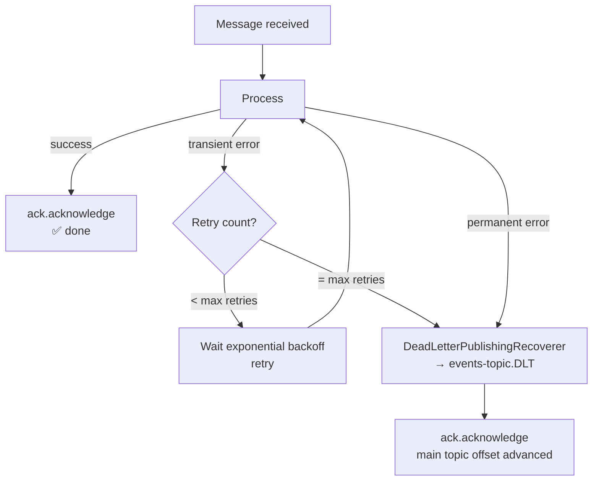
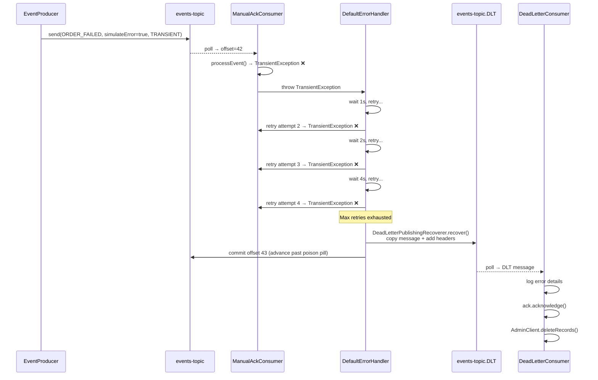

# 05 · Error Handling & Dead Letter Topics

!!! abstract "Learning Objectives"
    - Understand `DefaultErrorHandler` with exponential backoff
    - Explain how `DeadLetterPublishingRecoverer` routes failed messages to DLT
    - Walk through the DLT consumer pattern including offset deletion
    - Classify errors as transient, permanent, or validation

---

## Why Error Handling in Kafka is Different

In REST/HTTP, a failed request returns a 4xx/5xx and the caller retries. In Kafka:

1. The consumer receives a batch of messages and **must advance its offset** or it will keep re-consuming the same messages
2. A "poison pill" (a message that always fails) can **block an entire partition** forever if not handled
3. There is no caller to return an error to — the consumer must decide what to do

The solution is a **Dead Letter Topic (DLT)** + **retry with backoff**:



---

## DefaultErrorHandler

`DefaultErrorHandler` is Spring Kafka's built-in error handler. It:

1. Catches exceptions from listener methods
2. Applies a **backoff policy** between retries
3. After max retries, invokes a **recoverer** (e.g. send to DLT)

```java title="KafkaConfig.java — error handler"
@Bean
public DefaultErrorHandler errorHandler(KafkaTemplate<String, Object> kafkaTemplate) {
    // 1. Where to send messages that exhaust retries
    DeadLetterPublishingRecoverer recoverer =
            new DeadLetterPublishingRecoverer(kafkaTemplate,
                    (r, ex) -> new TopicPartition(dltTopic, 0)); // (1)!

    // 2. Retry policy: 3 retries with 1s→2s→4s backoff
    ExponentialBackOffWithMaxRetries backOff =
            new ExponentialBackOffWithMaxRetries(3);    // (2)!
    backOff.setInitialInterval(1000L);                 // (3)!
    backOff.setMultiplier(2.0);                        // (4)!

    return new DefaultErrorHandler(recoverer, backOff);
}
```

1. All DLT messages go to partition 0 of `events-topic.DLT` (1-partition topic, so this is always valid).
2. Maximum of 3 retries before giving up.
3. Wait 1 second before the first retry.
4. Each subsequent retry doubles the wait: 1s → 2s → 4s.

### Retry Timeline

```
Attempt 1: message consumed, exception thrown, wait 1000ms
Attempt 2: retry, exception thrown, wait 2000ms
Attempt 3: retry, exception thrown, wait 4000ms
Attempt 4: retry, exception thrown → MAX RETRIES EXCEEDED → send to DLT
```

Total time to DLT: ~7 seconds for a transient error.

---

## Exception Taxonomy

```java title="handler/CustomErrorHandler.java"
public class CustomErrorHandler {

    public enum ErrorClassification {
        TRANSIENT,       // temporary failure, worth retrying
        PERMANENT,       // won't succeed on retry (bug, bad data)
        DESERIALIZATION, // can't even parse the message bytes
        VALIDATION       // message parsed but fails business rules
    }

    public static class TransientException extends RuntimeException {
        public TransientException(String message) { super(message); }
    }

    public static class ValidationException extends RuntimeException {
        public ValidationException(String message) { super(message); }
    }
}
```

### How `EventProcessingService` Uses This

```java title="service/EventProcessingService.java"
public void processEvent(Event event) {
    if (event.isSimulateError()) {
        switch (event.getErrorType()) {
            case TRANSIENT -> throw new TransientException("Transient error");    // (1)!
            case PERMANENT -> throw new RuntimeException("Permanent error");      // (2)!
            case VALIDATION -> throw new ValidationException("Validation error"); // (3)!
            default -> {}
        }
    }
    // Happy path: business logic here
}
```

1. `TransientException` — retried 3 times with backoff, then to DLT.
2. `RuntimeException` — also retried 3 times (all unchecked exceptions are), then to DLT.
3. `ValidationException` — retried 3 times, then to DLT (same path, different root cause).

!!! tip "Non-retryable exceptions"
    You can configure `DefaultErrorHandler` to NOT retry certain exception types:
    ```java
    errorHandler.addNotRetryableExceptions(ValidationException.class);
    ```
    This sends them **directly** to DLT without retries — useful for validation/business rule failures.

---

## DeadLetterPublishingRecoverer

When `DefaultErrorHandler` exhausts retries, `DeadLetterPublishingRecoverer`:

1. **Copies** the original message to the DLT topic
2. Adds **diagnostic headers** to the DLT record:

| DLT Header | Content |
|-----------|---------|
| `kafka_dlt-exception-message` | Exception message string |
| `kafka_dlt-exception-fqcn` | Fully-qualified exception class name |
| `kafka_dlt-original-topic` | Original topic name |
| `kafka_dlt-original-partition` | Original partition number |
| `kafka_dlt-original-offset` | Original offset |
| `kafka_dlt-original-timestamp` | Original message timestamp |

---

## DeadLetterConsumer

```java title="consumer/DeadLetterConsumer.java"
@KafkaListener(topics = "${kafka.topics.dlt}", groupId = "dlt-consumer-group")
public void consumeDeadLetter(
        ConsumerRecord<String, Object> consumerRecord,
        @Header(value = KafkaHeaders.DLT_EXCEPTION_MESSAGE, required = false)
            String exceptionMessage,
        @Header(value = KafkaHeaders.DLT_ORIGINAL_TOPIC, required = false)
            String originalTopic,
        Acknowledgment ack) {

    log.error("=== DEAD LETTER RECEIVED ===");
    log.error("Original Topic: {}", originalTopic);
    log.error("Error: {}", exceptionMessage);
    log.error("Payload: {}", consumerRecord.value());

    ack.acknowledge();      // (1)!
    deleteMessage(consumerRecord); // (2)!
}
```

1. Commit the DLT offset first — don't block the partition.
2. Then asynchronously delete the physical record from the DLT.

### Physical Record Deletion

```java title="DeadLetterConsumer.deleteMessage()"
private void deleteMessage(ConsumerRecord<String, Object> consumerRecord) {
    TopicPartition tp = new TopicPartition(
            consumerRecord.topic(), consumerRecord.partition());
    long beforeOffset = consumerRecord.offset() + 1; // (1)!

    Map<TopicPartition, RecordsToDelete> toDelete =
            Map.of(tp, RecordsToDelete.beforeOffset(beforeOffset));

    try (AdminClient admin = AdminClient.create(
            kafkaAdmin.getConfigurationProperties())) {
        admin.deleteRecords(toDelete).all().get(); // (2)!
    }
}
```

1. `deleteRecords(beforeOffset=N)` removes all records with `offset < N`, i.e., exactly this message.
2. `AdminClient` is used to truncate the low-watermark of the partition — this is a **log truncation**, not a message delete flag.

!!! warning "deleteRecords is irreversible"
    Once truncated, those offsets are gone permanently. Only use this for messages you've fully handled and logged.

---

## Full DLT Flow End-to-End



---

## Key Takeaways

!!! success "What to remember"
    1. `DefaultErrorHandler` = retries + DLT routing in one bean
    2. Exponential backoff: 1s → 2s → 4s before DLT (after 3 retries = 4 total attempts)
    3. `DeadLetterPublishingRecoverer` copies message to DLT with diagnostic headers
    4. After DLT routing, the **main topic offset advances** — no stuck partition
    5. `DeadLetterConsumer` logs the failure, acks, then physically deletes the DLT record
    6. Use `addNotRetryableExceptions()` for validation errors you don't want to retry

---

## Up Next

➡️ [06 · Avro & Schema Registry](06-avro-and-schema-registry.md)

**Hands-on now?** → [Lab 04 · Error Handling & Retry](../labs/lab-04-error-handling.md) + [Lab 05 · Dead Letter Topic](../labs/lab-05-dead-letter-topic.md)

