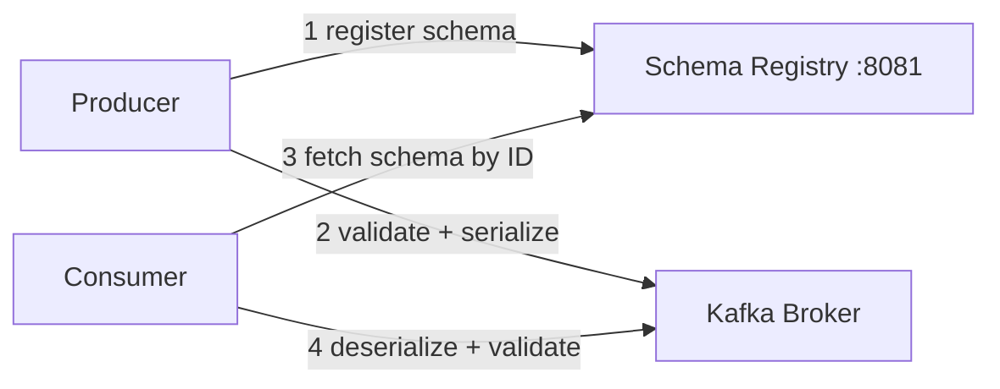
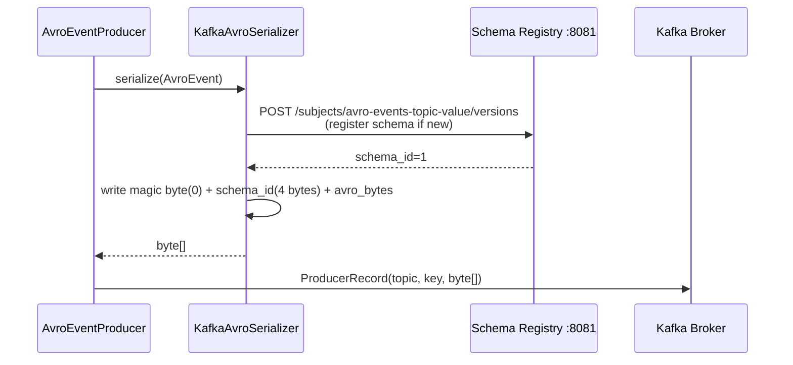

# 06 · Avro & Schema Registry

!!! abstract "Learning Objectives"
    - Understand why schema management matters in event-driven systems
    - Read and write an Avro `.avsc` schema file
    - Explain how code generation works with `avro-maven-plugin`
    - Trace the full schema registration and validation flow
    - Understand schema compatibility modes and when to use each

---

## Why Schema Management?

In a microservices event system, producers and consumers are **independently deployed**. Without a shared schema contract:

```
Producer v1 sends:  { "orderId": "123", "amount": 99.99 }
Consumer v2 expects: { "orderId": "123", "amount": 99.99, "currency": "USD" }
→ Consumer crashes — field missing!
```

**Confluent Schema Registry** solves this by acting as a **central schema store** with compatibility enforcement:



---

## Avro Schema — Event.avsc

```json title="src/main/avro/Event.avsc"
{
  "type": "record",
  "name": "AvroEvent",
  "namespace": "com.demo.kafka.avro",
  "doc": "Avro schema for Event messages.",
  "fields": [
    {
      "name": "eventId",
      "type": "string",              // (1)!
      "doc": "Unique identifier (UUID)"
    },
    {
      "name": "eventType",
      "type": "string",
      "doc": "Category, e.g. ORDER_CREATED"
    },
    {
      "name": "payload",
      "type": ["null", "string"],    // (2)!
      "default": null,
      "doc": "Optional business payload"
    },
    {
      "name": "timestamp",
      "type": { "type": "long", "logicalType": "timestamp-millis" }, // (3)!
      "doc": "Event creation time as epoch-millis"
    },
    {
      "name": "simulateError",
      "type": "boolean",
      "default": false
    },
    {
      "name": "errorType",
      "type": {
        "type": "enum",
        "name": "ErrorType",
        "symbols": ["NONE","TRANSIENT","PERMANENT","DESERIALIZATION","VALIDATION"] // (4)!
      },
      "default": "NONE"
    }
  ]
}
```

1. Primitive Avro types: `"null"`, `"boolean"`, `"int"`, `"long"`, `"float"`, `"double"`, `"bytes"`, `"string"`.
2. **Union type** `["null", "string"]` — the field can be null or a string. The `default: null` must match the first type in the union.
3. **Logical type** — Avro stores it as a `long` (epoch millis) but annotates it with semantics. Java mapping: `Instant`.
4. **Inline enum** — `ErrorType` becomes a separate generated Java class `com.demo.kafka.avro.ErrorType`.

---

## Code Generation with avro-maven-plugin

```xml title="pom.xml"
<plugin>
    <groupId>org.apache.avro</groupId>
    <artifactId>avro-maven-plugin</artifactId>
    <version>1.11.3</version>
    <executions>
        <execution>
            <phase>generate-sources</phase>
            <goals><goal>schema</goal></goals>
            <configuration>
                <sourceDirectory>${project.basedir}/src/main/avro</sourceDirectory>
                <outputDirectory>${project.basedir}/target/generated-sources/avro</outputDirectory>
            </configuration>
        </execution>
    </executions>
</plugin>
```

After `./mvnw compile`, two files are generated:

```
target/generated-sources/avro/com/demo/kafka/avro/
├── AvroEvent.java   ← the record class with builder, getters, setters
└── ErrorType.java   ← the enum class
```

**Never edit these files** — they're regenerated on every build from `Event.avsc`.

### Using the Generated Builder

```java
AvroEvent event = AvroEvent.newBuilder()
        .setEventId(UUID.randomUUID().toString())
        .setEventType("ORDER_CREATED")
        .setPayload("order-123")
        .setTimestamp(Instant.now())
        .setSimulateError(false)
        .setErrorType(ErrorType.NONE)
        .build();
```

---

## KafkaAvroSerializer — Producer Side

```java title="KafkaConfig.java — Avro producer factory"
props.put(ProducerConfig.VALUE_SERIALIZER_CLASS_CONFIG, KafkaAvroSerializer.class);
props.put(AbstractKafkaSchemaSerDeConfig.SCHEMA_REGISTRY_URL_CONFIG, schemaRegistryUrl);
```

On every `kafkaTemplate.send()`:



The **5-byte prefix** `[0x00][schema_id 4 bytes]` is the Confluent wire format. The consumer uses the schema ID to fetch the right schema from the registry.

---

## KafkaAvroDeserializer — Consumer Side

```java title="KafkaConfig.java — Avro consumer factory"
props.put(ConsumerConfig.VALUE_DESERIALIZER_CLASS_CONFIG, KafkaAvroDeserializer.class);
props.put(AbstractKafkaSchemaSerDeConfig.SCHEMA_REGISTRY_URL_CONFIG, schemaRegistryUrl);
props.put(KafkaAvroDeserializerConfig.SPECIFIC_AVRO_READER_CONFIG, true); // (1)!
```

1. Without `SPECIFIC_AVRO_READER=true`, the deserialiser returns a `GenericRecord` (a map-like object). With it, the deserialiser returns the **specific generated type** — `AvroEvent`.

```java title="AvroEventConsumer.java"
@KafkaListener(
    topics = "${kafka.topics.avro}",
    groupId = "avro-consumer-group",
    containerFactory = "avroKafkaListenerContainerFactory" // (1)!
)
public void consume(@Payload AvroEvent event, ...) {
    // event is a fully-typed AvroEvent, not a Map
}
```

1. The `containerFactory` attribute points to the Avro-specific factory — not the default JSON factory.

---

## Schema Compatibility Modes

The Schema Registry enforces compatibility rules when a new schema version is registered:

| Mode | Rule | Safe Change | Breaking Change |
|------|------|------------|----------------|
| `BACKWARD` ✅ (default) | New schema can read data written by old schema | Add optional field (`default`) | Remove required field, change type |
| `FORWARD` | Old schema can read data written by new schema | Remove optional field | Add required field |
| `FULL` | Both backward and forward compatible | Add/remove optional field | Any required field change |
| `NONE` | No compatibility check | Anything | Anything |

### Adding a Field Safely (BACKWARD)

```json
// v1 schema
{ "name": "source", "type": ["null", "string"], "default": null }
```

A consumer with the v1 schema can still read v2 records (it just ignores unknown fields) → **BACKWARD compatible** ✅

### Renaming a Field (BREAKING)

Renaming `eventId` → `id` removes the old field name → old consumers fail to read new records → **BACKWARD INCOMPATIBLE** ❌

---

## Schema Registry API

```bash
# List all registered subjects
curl -s http://localhost:8081/subjects | jq

# Get latest schema version
curl -s http://localhost:8081/subjects/avro-events-topic-value/versions/latest | jq

# View just the schema JSON
curl -s http://localhost:8081/subjects/avro-events-topic-value/versions/latest \
  | jq '.schema | fromjson'

# List all versions
curl -s http://localhost:8081/subjects/avro-events-topic-value/versions | jq

# Check global compatibility level
curl -s http://localhost:8081/config | jq
```

---

## Schema Validation Failure

If you try to send an object that doesn't match the registered schema:

```
SerializationException: Error registering Avro schema: ...
    or
SerializationException: Error serializing Avro message
```

The message **never reaches the Kafka broker** — the exception is thrown in the serialiser before `send()` completes. This is a key benefit: schema errors are caught at the **producer**, not discovered later by consumers.

---

## Key Takeaways

!!! success "What to remember"
    1. Avro schemas are defined in `.avsc` files — **single source of truth**
    2. `avro-maven-plugin` generates Java classes at build time — never edit generated files
    3. `KafkaAvroSerializer` registers + validates schema on every `send()` call
    4. The Confluent wire format prefixes 5 bytes `[magic][schema_id]` to every message
    5. `SPECIFIC_AVRO_READER=true` returns strongly-typed generated classes, not `GenericRecord`
    6. `BACKWARD` compatibility = safe to add optional fields; breaking = field renames/removals/type changes
    7. Schema errors fail at the producer — messages never reach the broker

---

## Up Next

➡️ [07 · Advanced Patterns](07-advanced-patterns.md)

**Hands-on now?** → [Lab 06 · Avro & Schema Registry](../labs/lab-06-avro-schema-registry.md)

