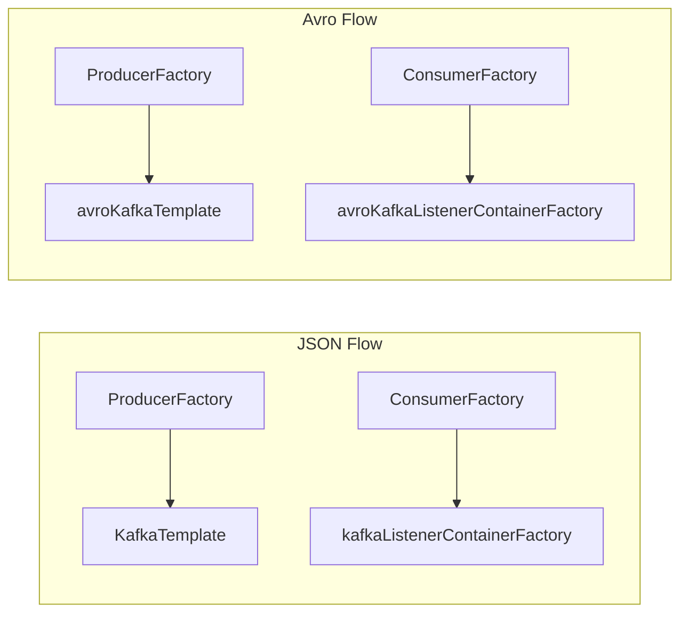
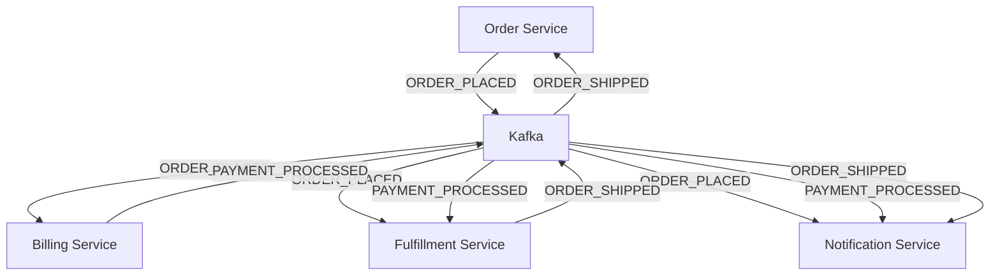

# 07 · Advanced Patterns

!!! abstract "Learning Objectives"
    - Understand multi-factory and multi-topic listener configuration
    - Explain idempotent producers and exactly-once semantics
    - Describe partitioning strategies for microservices
    - Place Kafka within a broader event-driven microservices architecture
    - Know when to scale consumers vs partitions

---

## Multi-Factory Configuration

This project runs **two serialisation formats** (JSON and Avro) side-by-side using separate factories:



The `containerFactory` attribute on `@KafkaListener` selects which factory to use:

```java
// Uses the DEFAULT factory (kafkaListenerContainerFactory)
@KafkaListener(topics = "${kafka.topics.main}", groupId = "manual-ack-group")
public void consume(@Payload Event event, ...) { }

// Explicitly names the Avro factory
@KafkaListener(
    topics = "${kafka.topics.avro}",
    groupId = "avro-consumer-group",
    containerFactory = "avroKafkaListenerContainerFactory"  // ← key
)
public void consume(@Payload AvroEvent event, ...) { }
```

!!! tip "Naming convention"
    Spring uses `kafkaListenerContainerFactory` as the **default** factory name. Any other name must be specified explicitly.

---

## ConcurrentKafkaListenerContainerFactory — Concurrency

```java
factory.setConcurrency(3); // creates 3 consumer threads per listener
```

With `concurrency=3` and a 3-partition topic, each thread owns one partition:

```
Thread 1 → Partition 0
Thread 2 → Partition 1
Thread 3 → Partition 2
```

With `concurrency=1` (the project default — not explicitly set), one thread handles all partitions sequentially.

!!! warning "concurrency ≤ partitions"
    Setting concurrency higher than the number of partitions means extra threads sit idle. Always scale partitions first, then concurrency.

---

## Idempotent Producers

By default, Kafka producers can produce **duplicate messages** if the broker acknowledges the write but the network drops the ACK before the producer receives it → producer retries → duplicate.

Enable idempotence:

```java
props.put(ProducerConfig.ENABLE_IDEMPOTENCE_CONFIG, true);
// Automatically sets:
// acks=all, retries=MAX_INT, max.in.flight.requests.per.connection=5
```

With idempotent producers, Kafka deduplicates retries using a sequence number — each `(producer_id, partition, sequence_number)` is written exactly once.

---

## Exactly-Once Semantics (EOS)

EOS = exactly-once end-to-end (producer → broker → consumer). Requires:

1. **Idempotent producer** (above)
2. **Transactions** on the producer side:

```java
props.put(ProducerConfig.TRANSACTIONAL_ID_CONFIG, "my-app-tx-1");
kafkaTemplate.executeInTransaction(ops -> {
    ops.send(topicA, key, valueA);
    ops.send(topicB, key, valueB);
    return true;
}); // either both messages are written, or neither
```

3. **Consumer `isolation.level=read_committed`**:
```java
props.put(ConsumerConfig.ISOLATION_LEVEL_CONFIG, "read_committed");
// Consumers only see committed transactional messages
```

!!! info "This project uses at-least-once"
    EOS adds latency and complexity. Most microservices use at-least-once + idempotent consumers (deduplication by `eventId`). EOS is only needed when the business absolutely cannot tolerate duplicates AND cannot deduplicate downstream.

---

## Partitioning Strategies

### Default — Sticky Partitioner (Kafka 2.4+)

When no key is specified, the producer batches messages to the **same partition** until the batch is full or the linger time expires, then rotates. This maximises throughput.

### Key-Based — Murmur2 Hash

```java
partition = murmur2(key.getBytes()) % numPartitions
```

Same key → same partition → **ordering guarantee for related events**.

In this project, `event.getEventId()` is used as the key. Since UUIDs are random, events distribute evenly across partitions.

### Custom Partitioner

```java
public class OrderPartitioner implements Partitioner {
    @Override
    public int partition(String topic, Object key, byte[] keyBytes,
                         Object value, byte[] valueBytes, Cluster cluster) {
        // Route VIP orders to partition 0 for priority processing
        if (key.toString().startsWith("VIP-")) return 0;
        return murmur2(keyBytes) % (cluster.partitionCountForTopic(topic) - 1) + 1;
    }
}
```

Register it:
```java
props.put(ProducerConfig.PARTITIONER_CLASS_CONFIG, OrderPartitioner.class);
```

---

## When to Add Partitions

| Signal | Action |
|--------|--------|
| Consumer lag growing consistently | Add partitions + scale consumer instances |
| Producer throughput maxed out | Add partitions |
| One partition overwhelmed (hot key) | Revisit key design or add custom partitioner |

!!! warning "Adding partitions is irreversible"
    You can increase partition count but never decrease it (without deleting the topic). Key-based routing changes when partitions are added — existing messages are not redistributed.

---

## Kafka in Microservices Architecture



### Key Design Principles

1. **Events, not commands** — publish what happened ("ORDER_PLACED"), not instructions ("PROCESS_ORDER"). Any service can react independently.
2. **Consumer owns its schema** — each service defines what fields it needs. Use a shared schema registry to enforce contracts.
3. **Choreography over orchestration** — services react to events; no central coordinator needed. This reduces coupling.
4. **Bounded retry per service** — each service has its own DLT. A failure in Billing doesn't affect Fulfillment.

---

## Monitoring Checklist

| Metric | Where to Check | Alert Threshold |
|--------|---------------|----------------|
| Consumer lag | Kafka-UI → Consumers | > 1000 messages |
| DLT message count | Kafka-UI → `events-topic.DLT` → Messages | > 0 |
| Producer send failures | App logs / metrics | Any |
| Schema Registry errors | `docker logs schema-registry` | Any |
| Broker disk usage | Kafka-UI → Brokers | > 70% |

---

## Key Takeaways

!!! success "What to remember"
    1. Use separate factories for different serialisation formats; use `containerFactory` to select
    2. Set `concurrency ≤ partition count` — extra threads are idle, not helpful
    3. Idempotent producers prevent duplicates caused by network retry; EOS is for stronger guarantees
    4. Most production systems use **at-least-once + idempotent consumers** — simpler than EOS
    5. Partition count is a one-way door — plan ahead; more partitions = more parallelism
    6. Kafka enables choreographed microservices — services react to events independently

---

## Congratulations! 🎉

You've completed all 7 theory modules. Head to the **Interview Guide** to test your knowledge, or revisit labs for hands-on reinforcement.

➡️ [Interview Guide](../interview-guide/index.md)

