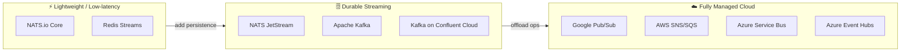
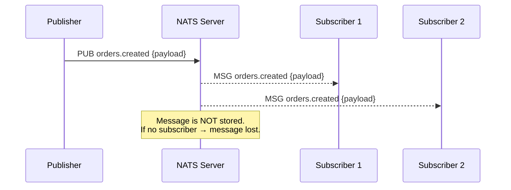
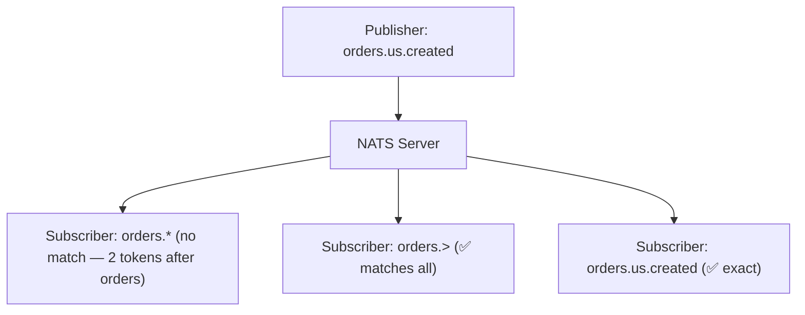
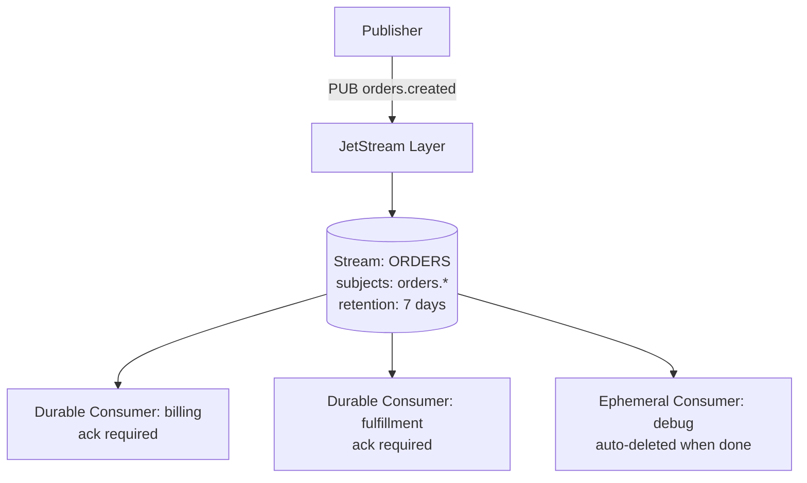
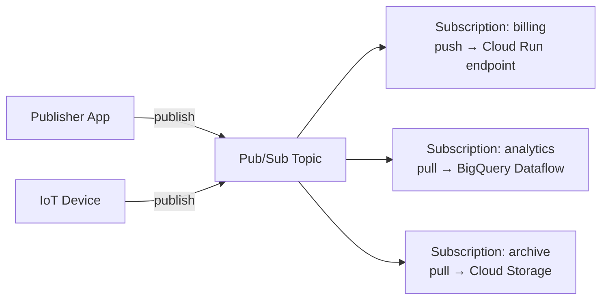
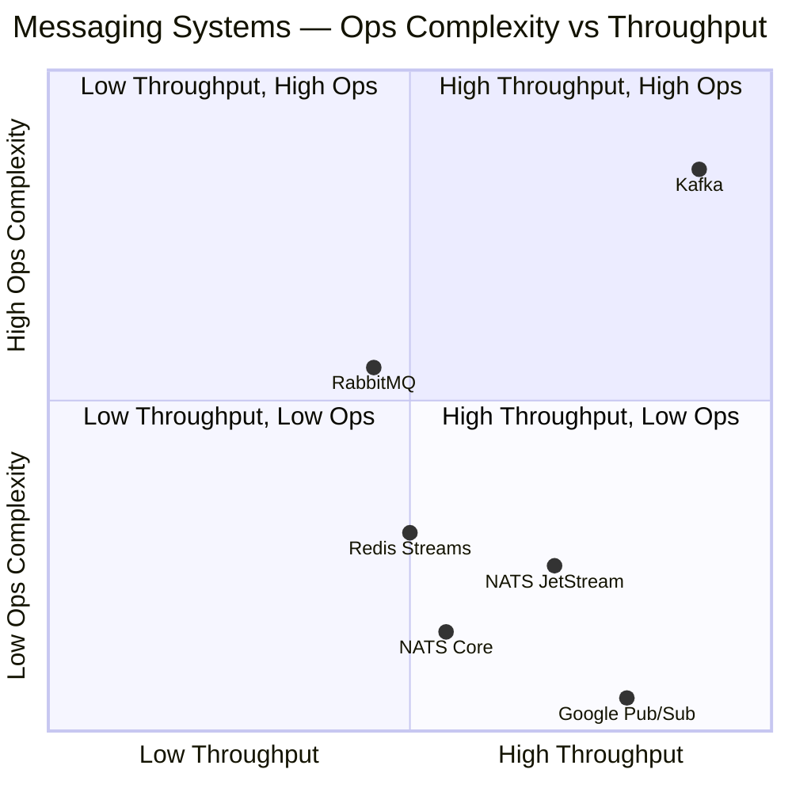
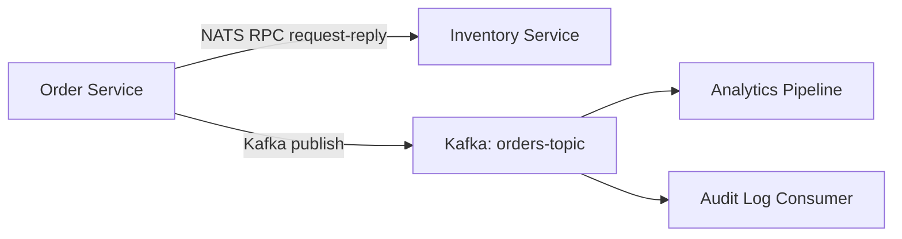
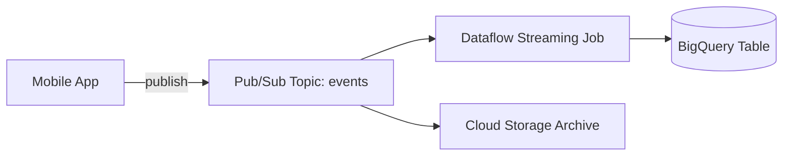
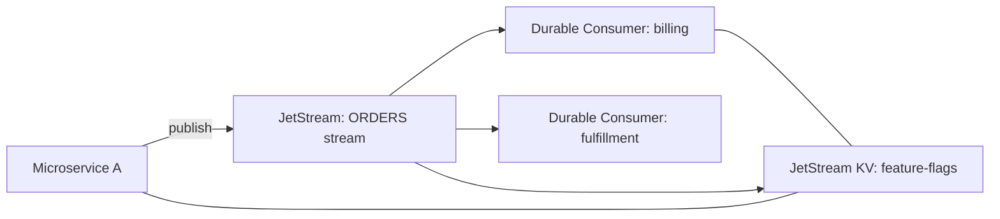

# 08 · NATS.io, Google Pub/Sub & The Messaging Landscape

!!! abstract "Learning Objectives"
    After this module you will be able to:

    - Explain what NATS.io is and how it differs from Kafka
    - Describe NATS JetStream and when to use it
    - Explain Google Cloud Pub/Sub's model and its ideal use cases
    - Compare the major messaging / streaming platforms across key dimensions
    - Choose the right tool for a given architectural requirement

---

## The Big Picture — Why So Many Systems?

Event-driven and streaming architectures come in many flavours because no single tool wins every trade-off:



> **Rule of thumb:** Pick the simplest system that satisfies your latency, durability, ordering, and operational budget requirements.

---

## NATS.io — The Lightweight Messaging Backbone

### What Is NATS?

**NATS** (Neural Autonomic Transport System) is an open-source, cloud-native messaging system written in Go. Its design goals are:

- **Simplicity** — a single ~20 MB binary, zero external dependencies
- **Speed** — sub-millisecond latencies even at high throughput
- **Multi-tenancy** — built-in accounts and security without extra infrastructure
- **Ubiquity** — runs on cloud, edge, IoT devices, and embedded systems

> NATS is maintained by Synadia and is a CNCF (Cloud Native Computing Foundation) **incubating** project.

### Core NATS — Publish / Subscribe

NATS Core uses a **fire-and-forget** model:



Key characteristics:

| Feature | Value |
|---------|-------|
| Protocol | Custom text-based over TCP (NATS protocol) |
| Message storage | ❌ None in Core — fire-and-forget |
| Delivery guarantee | At-most-once |
| Latency | < 1 ms (typically ~100 µs) |
| Subject naming | Hierarchical with wildcards (`orders.*`, `orders.>`) |
| Queue groups | Load-balance among subscribers (like competing consumers) |

### Subject Hierarchy and Wildcards

NATS uses **dot-separated subjects** instead of topics:

```
orders.created          ← exact match
orders.updated
orders.*.shipped        ← * matches exactly one token
orders.>               ← > matches one or more tokens (recursive)
```



### Queue Groups — Load Balancing

In NATS, **queue groups** turn pub/sub into a competing-consumer pattern:

```
Publisher → NATS Server → [worker-group: instance-1]
                        → (skipped: instance-2)
                        → (skipped: instance-3)
```

Only **one** member of a queue group receives each message — NATS selects randomly. This is the NATS equivalent of Kafka's consumer groups.

---

## NATS JetStream — Persistence Layer on Top of NATS

### Why JetStream?

Core NATS is fast but ephemeral. **JetStream** adds durable streaming capabilities directly into the NATS server — no separate broker or ZooKeeper needed.

JetStream was introduced in NATS 2.2 (2021) and provides:

- **Persistent message storage** (file or memory)
- **At-least-once** delivery
- **Exactly-once** delivery (via deduplication window)
- **Consumer acknowledgements** and redelivery on failure
- **Replay** of historical messages
- **Key-Value store** and **Object store** built on top



### Streams vs Consumers

| Concept | Description | Kafka Analogue |
|---------|-------------|----------------|
| **Stream** | Named storage binding one or more subjects | Topic |
| **Consumer** | View into a stream for a specific subscriber | Consumer Group |
| **Sequence number** | Monotonic ID per message in a stream | Offset |
| **Durable consumer** | Survives server restart | Committed consumer group |
| **Ephemeral consumer** | Deleted when inactive | Temporary consumer |

### JetStream Retention Policies

```
Limits     — retain up to N messages / N bytes / N age
Interest   — retain only while at least one consumer exists
WorkQueue  — delete message after all consumers ACK it
```

!!! info "WorkQueue = Queue Semantics"
    `WorkQueue` retention gives you traditional task-queue behaviour (like RabbitMQ) — the message disappears once consumed, unlike Kafka's log-based model.

### Delivery Policies (Replay Options)

```
All            — replay from the very first message (like Kafka offset=earliest)
Last           — only the most recent message
New            — only messages arriving after subscription
ByStartSequence — start from a specific sequence number
ByStartTime    — start from a point in time
```

### Exactly-Once Delivery

NATS JetStream achieves exactly-once via a **deduplication window**:

```
Publisher sends message with Nats-Msg-Id: uuid-abc123
JetStream checks: seen this ID in the last 2 minutes?
  YES → discard duplicate
  NO  → store and deliver
```

On the consumer side, **double-ACK** ensures the server knows the client received the ACK:

```
Client → ACK → Server → ACK-ACK → Client  (both sides confirm)
```

### JetStream Key-Value Store

JetStream exposes a **Key-Value API** backed by a stream:

```
nats kv put my-bucket config.timeout 30s
nats kv get my-bucket config.timeout
nats kv watch my-bucket          ← subscribe to all changes
```

This replaces ZooKeeper / etcd for lightweight use cases — service discovery, distributed config, leader election.

---

## Google Cloud Pub/Sub

### What Is Google Pub/Sub?

**Google Cloud Pub/Sub** is a fully managed, serverless, globally distributed messaging service. You pay per message — there are no brokers, clusters, or partitions to manage.



### Core Concepts

| Concept | Description | Kafka Analogue |
|---------|-------------|----------------|
| **Topic** | Named message channel | Topic |
| **Subscription** | Named view of a topic (pull or push) | Consumer Group |
| **Publisher** | Sends messages to a topic | Producer |
| **Subscriber** | Receives from a subscription | Consumer |
| **Message ID** | Server-assigned unique ID | Offset |
| **Ack deadline** | Time to process before redelivery (default 10s, max 600s) | N/A |

### Pull vs Push Subscriptions

**Pull** — consumer calls Pub/Sub to fetch messages (like Kafka `poll()`):

```python
# Pull model
subscriber = pubsub_v1.SubscriberClient()
response = subscriber.pull(subscription=sub_path, max_messages=100)
for msg in response.received_messages:
    process(msg.message.data)
    subscriber.acknowledge(subscription=sub_path, ack_ids=[msg.ack_id])
```

**Push** — Pub/Sub calls your HTTPS endpoint (webhook / Cloud Run):

```
Pub/Sub → POST https://my-service.run.app/pubsub-handler
         { "message": { "data": "base64...", "messageId": "..." } }
Service → HTTP 200 = ACK, non-200 = NACK (redeliver)
```

!!! tip "Push is ideal for serverless"
    Push subscriptions wake up Cloud Run / Cloud Functions on demand — you pay only when messages arrive. No polling loop required.

### Dead-Letter Topics in Pub/Sub

Pub/Sub has native dead-letter support:

```
Subscription config:
  deadLetterPolicy:
    deadLetterTopic: projects/my-proj/topics/orders-dlq
    maxDeliveryAttempts: 5
```

After 5 failed deliveries (NACKs or expired ack deadlines) the message is forwarded to the DLQ topic automatically.

### Message Ordering

By default, Pub/Sub does **not guarantee ordering**. To get ordered delivery:

1. Publisher sets an **ordering key** on messages with the same key
2. Subscription enables `enable_message_ordering = true`
3. Pub/Sub delivers messages with the same key in order to **one** subscriber

!!! warning "Ordering caveat"
    Ordering keys reduce parallelism — all messages with the same key go to a single subscriber endpoint sequentially.

### Retention and Replay

```
Default retention: 7 days (configurable 10 min – 31 days)
Seek to timestamp:  subscription.seek(time=datetime(2026,4,20))
Seek to snapshot:   subscription.seek(snapshot=snap_name)
```

Pub/Sub allows rewinding a subscription to replay from a past timestamp — similar to resetting a Kafka consumer offset.

---

## Comparison: Kafka vs NATS Core vs NATS JetStream vs Google Pub/Sub



| Dimension | Kafka | NATS Core | NATS JetStream | Google Pub/Sub |
|-----------|-------|-----------|----------------|----------------|
| **Primary model** | Distributed log | Fire-and-forget pub/sub | Persistent streaming | Managed pub/sub |
| **Delivery guarantee** | At-least-once (default) | At-most-once | At-least / exactly-once | At-least-once |
| **Ordering** | Per-partition | None | Per-stream (no partitions) | Per ordering-key |
| **Replay** | ✅ Reset offset | ❌ | ✅ Sequence / time | ✅ Seek to time/snapshot |
| **Retention** | Time / size policy | None | Time / size / interest | 10 min – 31 days |
| **Throughput** | Millions/sec | Millions/sec | Hundreds of thousands/sec | Millions/sec |
| **Latency** | ~5–15 ms | < 1 ms | ~1–5 ms | 50–200 ms |
| **Ops burden** | High (cluster, ZK/KRaft) | Very low (single binary) | Low (single binary) | Zero (fully managed) |
| **Multi-tenancy** | Via clusters | Built-in accounts | Built-in accounts | GCP projects |
| **Schema registry** | External (Confluent) | None | None | None (use Protobuf conventions) |
| **Cloud-native** | Self-hosted / Confluent Cloud | Self-hosted / Synadia Cloud | Self-hosted / Synadia Cloud | GCP native |
| **Cost model** | Infrastructure | Infrastructure | Infrastructure | Pay-per-message |
| **Best for** | Event sourcing, audit log, high-volume pipelines | IoT, edge, microservice RPC, low-latency signals | Durable microservice events, K/V store, work queues | Serverless integrations, GCP ecosystem, global fan-out |

---

## How Streaming Services Actually Work

### The Log-Based Model (Kafka, JetStream)

```
Write → append to log
Read  → seek to position, read forward

[0][1][2][3][4][5][6] → immutable, ordered
 ↑                 ↑
oldest          newest
Consumer A offset=2 ──────────────┘ reads 3,4,5,6
Consumer B offset=5 ─────────────────────────┘ reads 6
```

- Messages are **immutable** — never modified, only appended
- Multiple consumers read **independently** — each tracks its own position
- Enables **time travel** — reset position to replay past events
- Storage is the bottleneck, not compute

### The Queue Model (Traditional / JetStream WorkQueue)

```
Enqueue → [msg1][msg2][msg3]
Dequeue → msg1 removed after ACK
          [msg2][msg3]
```

- Message exists once and is consumed by one worker
- Simple but no replay, no fan-out to multiple consumers

### The Broker-Dispatch Model (Pub/Sub Push, RabbitMQ)

```
Message arrives → broker decides who gets it → pushes to consumer
Consumer NACKs  → broker requeues / retries
Consumer ACKs   → broker deletes message
```

- Consumer does not poll — the broker drives delivery
- Great for serverless / reactive patterns
- No concept of "position" — broker manages state

---

## When to Use What

### Use **Apache Kafka** when:

- You need **high-throughput event streaming** (>500k events/sec)
- **Replay / event sourcing** is a core requirement
- You need strict **per-partition ordering**
- You are building a **data pipeline** connecting multiple systems (CDC, ETL)
- You need a **durable audit log** that multiple teams consume independently
- You are already in the JVM / Spring ecosystem

### Use **NATS Core** when:

- You need **ultra-low latency** (sub-millisecond) messaging
- Messages are **transient signals** — presence beats persistence (IoT heartbeats, live telemetry)
- You are building **edge / embedded** systems with tight resource constraints
- You need a **simple RPC** layer between microservices
- No need for replay or durable storage

### Use **NATS JetStream** when:

- You want NATS simplicity **plus durability**
- Your team can't operate a Kafka cluster but needs at-least-once delivery
- You need a **built-in K/V store** or **distributed config** without etcd
- You want **work-queue semantics** (delete after consumption) with durable storage
- You are building on **edge / IoT** devices where Kafka's JVM footprint is too heavy

### Use **Google Cloud Pub/Sub** when:

- You are **all-in on GCP** and want zero operational overhead
- You need **global fan-out** across regions without managing replication
- You are building **serverless** pipelines (Cloud Run, Cloud Functions)
- You want native integration with **BigQuery, Dataflow, Cloud Storage**
- Your team has no dedicated infrastructure engineering capacity

### Use **Redis Streams** when:

- You already use Redis and want lightweight streaming
- Messages are short-lived with small payloads
- You need **consumer group** semantics without a separate broker

### Use **RabbitMQ** when:

- You need **complex routing** (topic exchanges, header-based routing, fanout)
- You are in a **.NET / Ruby / PHP** ecosystem (great AMQP client support)
- Task-queue semantics with flexible retry / dead-letter routing

---

## Architecture Patterns and Hybrid Designs

### Pattern 1 — NATS as Service Mesh + Kafka as Event Log



NATS handles **synchronous service-to-service** calls; Kafka handles **durable asynchronous events**.

### Pattern 2 — Google Pub/Sub Ingestion → BigQuery



Pub/Sub acts as the **ingestion buffer**; Dataflow transforms and loads into BigQuery for analytics.

### Pattern 3 — JetStream as Lightweight Kafka Alternative



Entire event backbone — streams, K/V config, work queues — runs in a **single NATS server binary**.

---

## Key Takeaways

!!! success "What to remember"
    1. **NATS Core** is fire-and-forget — fastest possible latency, zero persistence, ideal for signals and RPC
    2. **NATS JetStream** adds Kafka-like durability on top of NATS — streams, consumers, K/V store, all in one binary
    3. **Google Pub/Sub** is the zero-ops cloud alternative — global, serverless, pay-per-message, tight GCP integration
    4. **Kafka** remains the gold standard for **high-throughput durable event logs** with strict ordering and replay
    5. Use **log-based** systems (Kafka, JetStream) when replay matters; use **queue-based** when consume-once is sufficient
    6. No single system wins every trade-off — hybrid architectures are common and valid

---

## Further Reading

| Resource | URL |
|----------|-----|
| NATS Documentation | https://docs.nats.io |
| JetStream Deep Dive | https://docs.nats.io/nats-concepts/jetstream |
| Google Pub/Sub Docs | https://cloud.google.com/pubsub/docs |
| Kafka vs NATS Benchmark | https://nats.io/blog/kafka-and-nats |
| Pub/Sub vs Kafka (Google) | https://cloud.google.com/pubsub/docs/choosing-pubsub-or-kafka |

---

## Up Next

➡️ You've reached the end of the core theory modules. Review the [Interview Guide](../interview-guide/index.md) to test your knowledge.

**Want hands-on practice?** → [Lab 07 · Advanced Scenarios](../labs/lab-07-advanced-scenarios.md)

