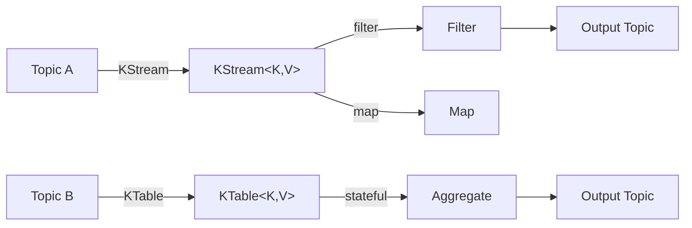

# Kafka Streams (09)

!!! abstract "Learning Objectives"
    - Understand what Kafka Streams is and how it differs from Kafka Consumer API
    - Compare Kafka Streams, Apache Flink, Apache Spark Streaming, and ksqlDB
    - Master core abstractions: KStream, KTable, GlobalKTable, and their semantics
    - Implement stateless operations: filter, map, flatMap, branch
    - Implement stateful operations: groupBy, count, aggregate, reduce
    - Use windowing: tumbling, hopping, session, and grace period
    - Perform stream-table joins and interactive queries
    - Understand topology, processing guarantees, and state stores
    - Know when to choose Kafka Streams vs alternatives

---

## What is Kafka Streams?

Kafka Streams is a **client-side stream processing library** for building applications that compute continuous transformations on Kafka topics. It runs _inside_ your application process, not as a separate cluster.

### Key Characteristics

| Aspect | Details |
|--------|---------|
| **Deployment** | Embedded in your Java application; no separate cluster needed |
| **Semantics** | Exactly-once (EOS), at-least-once (AOO) configurable |
| **State** | Local RocksDB state stores, co-located with your processor |
| **Topology** | DAG of processors; defined programmatically |
| **Scaling** | Scale by running multiple instances of your app; Kafka handles coordination |



---

## Kafka Streams vs Kafka Consumer API

### Kafka Consumer API (Low-Level)

```java
// Manual control — you manage everything
KafkaConsumer<String, String> consumer = new KafkaConsumer<>(props);
consumer.subscribe(List.of("input-topic"));

while (true) {
    ConsumerRecords<String, String> records = consumer.poll(Duration.ofMillis(100));
    for (ConsumerRecord<String, String> record : records) {
        // Process record
        String output = record.value().toUpperCase();
        // Manually send to another topic if needed
        producer.send(new ProducerRecord<>("output-topic", output));
    }
    consumer.commitSync(); // Manual offset management
}
```

**Pros:**
- Fine-grained control
- Simple for basic transformations

**Cons:**
- Manual state management
- No built-in joins, windowing, or aggregations
- Error handling is boilerplate-heavy
- Scaling requires manual consumer group logic

### Kafka Streams (High-Level DSL)

```java
StreamsBuilder builder = new StreamsBuilder();

builder
    .stream("input-topic", Consumed.with(Serdes.String(), Serdes.String()))
    .mapValues(v -> v.toUpperCase())
    .to("output-topic", Produced.with(Serdes.String(), Serdes.String()));

KafkaStreams streams = new KafkaStreams(builder.build(), props);
streams.start();
```

**Pros:**
- Declarative DSL for complex transformations
- Built-in state management and RocksDB
- Joins, windowing, aggregations out-of-the-box
- Exactly-once semantics
- Automatic scaling (topic-partition aware)

**Cons:**
- Less control than Consumer API (by design)
- Requires understanding of topology
- State store setup has overhead

!!! tip "Use Streams if..."
    You need stateful operations, joins, windowing, or complex transformations. Use Consumer API for simple, single-threaded message processing.

---

## Kafka Streams vs Alternatives

### Apache Flink

| Aspect | Kafka Streams | Flink |
|--------|---------------|-------|
| **Deployment** | Embedded in app | Separate cluster |
| **Learning curve** | Moderate | Steep |
| **Complex joins** | Good | Excellent |
| **SQL support** | ksqlDB (separate) | SQL with Flink SQL |
| **Ecosystem** | Kafka-native | Language-agnostic (Java, Scala, Python) |
| **Ops overhead** | None | Significant |
| **Best for** | Kafka-first microservices | Enterprise stream processing |

### Apache Spark Streaming

| Aspect | Kafka Streams | Spark |
|--------|---------------|-------|
| **Processing model** | Event-at-a-time | Micro-batches (default) |
| **Latency** | Sub-second | Second+ |
| **Learning curve** | Moderate | Moderate-Steep |
| **Ecosystem** | Kafka-native | ML, SQL, graph processing |
| **Scaling** | Auto (partition-aware) | Manual cluster config |
| **Ops overhead** | Minimal | Cluster management required |
| **Best for** | Low-latency event streams | Analytics, batched analytics |

### ksqlDB

| Aspect | Kafka Streams | ksqlDB |
|--------|---------------|--------|
| **Language** | Java DSL | SQL |
| **Deployment** | Embedded | Separate cluster |
| **Use case** | Complex logic in Java | Ad-hoc SQL queries, dashboards |
| **Statefulness** | Implicit (RocksDB) | Server-managed |
| **Best for** | Production app logic | Analytics, exploration |

!!! info "Decision Tree"
    - **Need SQL interface?** → ksqlDB
    - **Kafka microservices with Java?** → Kafka Streams
    - **Complex joins + big data?** → Flink
    - **Analytics over batches?** → Spark
    - **Simple message processing?** → Kafka Consumer API

---

## Core Abstractions

### KStream

A **KStream** represents a **record stream** — a changelog of individual events. Every message is a new event.

```java
KStream<String, Order> orders = builder.stream("orders-topic");

// KStream properties:
// - Stateless operations only (filter, map, flatMap, peek)
// - Or group → become stateful
// - Each key can have multiple values over time
```

**Characteristics:**
- No retention of old records
- All records are processed independently
- Similar to a "stream of transactions"

### KTable

A **KTable** represents a **changelog table** — the latest value per key. When you send a message with an existing key, it replaces the previous value.

```java
KTable<String, Customer> customers = builder.table("customers-topic");

// KTable properties:
// - Can be joined with KStream
// - Represents "current state" per key
// - Useful for enrichment (customer lookup by ID)
```

**Characteristics:**
- Only the latest value per key is retained
- Similar to a "snapshot of a database table"
- When you join KStream + KTable, the KTable enriches the stream

### GlobalKTable

A **GlobalKTable** is a **read-only, fully replicated table** available to all processors.

```java
GlobalKTable<String, GeoCode> geos = builder.globalTable(
    "geo-topic",
    Materialized.as("geo-store")
);

// All processors can look up any geo code without network call
```

**Characteristics:**
- Entire table replicated to each instance (memory cost)
- No repartitioning needed for joins
- Use only for small reference data (< 1 GB)

### KGroupedStream & KGroupedTable

Intermediate types created by **groupBy** operations. Used to aggregate or count.

```java
KStream<String, Order> orders = builder.stream("orders-topic");

// groupBy creates a KGroupedStream
KGroupedStream<String, Order> ordersPerCustomer = 
    orders.groupByKey(); // or orders.groupBy((k, v) -> customKey)

// Can aggregate or count
ordersPerCustomer
    .count()
    .toStream()
    .to("order-counts-topic");
```

---

## Stateless Operations

Stateless operations process each message independently without remembering previous messages.

### filter

Keep only messages matching a condition.

```java
KStream<String, Order> orders = builder.stream("orders-topic");

orders
    .filter((key, order) -> order.getAmount() > 100)
    .to("large-orders-topic");
```

### map & mapValues

Transform the value (or both key and value).

```java
// mapValues — keeps key, transforms value
orders
    .mapValues(order -> order.getAmount() * 0.9) // 10% discount
    .to("discounted-orders");

// map — transforms both key and value
orders
    .map((orderId, order) -> 
        new KeyValue<>(order.getCustomerId(), order))
    .to("orders-by-customer");
```

### flatMap & flatMapValues

Emit zero or more records per input record.

```java
KStream<String, Order> orders = builder.stream("orders-topic");

orders
    .flatMapValues(order -> {
        // Split an order into line items
        return order.getLineItems()
            .stream()
            .map(item -> "Item: " + item)
            .collect(Collectors.toList());
    })
    .to("line-items-topic");
```

### peek

Perform a side effect without modifying the stream.

```java
orders
    .peek((key, order) -> log.info("Processing order: {}", key))
    .filter((k, v) -> v.getAmount() > 100)
    .to("large-orders");
```

### branch

Conditionally route messages to different streams.

```java
KStream<String, Order>[] branches = orders
    .branch(
        (k, order) -> order.getAmount() > 500,  // High-value
        (k, order) -> order.getAmount() > 100,  // Medium
        (k, order) -> true                       // Low (catch-all)
    );

branches[0].to("high-value-orders");
branches[1].to("medium-orders");
branches[2].to("low-value-orders");
```

---

## Stateful Operations

Stateful operations maintain state across multiple messages (using local RocksDB).

### groupBy & groupByKey

Repartition the stream by a key. Prerequisite for aggregations.

```java
KStream<String, Order> orders = builder.stream("orders-topic");

// Group by customer ID
KGroupedStream<String, Order> byCustomer = 
    orders.groupBy((orderId, order) -> order.getCustomerId());

// Now you can aggregate
byCustomer
    .count()
    .toStream()
    .to("customer-order-count");
```

### count

Count the number of records per key.

```java
byCustomer
    .count(Materialized.as("order-count-store"))
    .toStream()
    .to("customer-order-counts");
```

Output topic messages:
```
Customer_1: 5
Customer_2: 3
Customer_1: 6  // Update when a new order arrives
```

### reduce

Fold messages into a single value per key.

```java
KStream<String, Transaction> transactions = 
    builder.stream("transactions-topic");

transactions
    .groupByKey()
    .reduce(
        (agg, tx) -> {
            agg.setTotal(agg.getTotal() + tx.getAmount());
            return agg;
        },
        Materialized.as("transaction-total-store")
    )
    .toStream()
    .to("customer-totals");
```

### aggregate

Similar to reduce, but with an initializer.

```java
byCustomer
    .aggregate(
        () -> new OrderStats(),                    // Initializer
        (custId, order, stats) -> {
            stats.incrementCount();
            stats.addAmount(order.getAmount());
            return stats;
        },
        Materialized.as("customer-order-stats")
    )
    .toStream()
    .to("customer-stats");
```

---

## Windowing

Windowing groups records by **time** and optionally by **key**.

### Tumbling Windows

Non-overlapping, fixed-size windows. Events in window `[0, 5)` are separate from `[5, 10)`.

```java
Duration windowSize = Duration.ofSeconds(60);

orders
    .groupByKey()
    .windowedBy(TimeWindows.ofSizeWithNoGrace(windowSize))
    .count()
    .toStream()
    .map((wk, count) -> {
        String window = String.format(
            "%s: %s-%s (%,d orders)",
            wk.key(),
            wk.window().startTime(),
            wk.window().endTime(),
            count
        );
        return new KeyValue<>(window, count);
    })
    .to("orders-per-minute");
```

Example output:
```
Customer_1: [2024-04-23 10:00:00 - 10:01:00] (42 orders)
Customer_1: [2024-04-23 10:01:00 - 10:02:00] (38 orders)
```

### Hopping Windows

Overlapping windows. A record can belong to multiple windows.

```java
Duration windowSize = Duration.ofSeconds(60);
Duration hopSize = Duration.ofSeconds(30);

orders
    .groupByKey()
    .windowedBy(TimeWindows.of(windowSize).advanceBy(hopSize))
    .count()
    .toStream()
    .to("hopping-order-counts");
```

Timeline:
```
Window 1: [0, 60)      <-- record at t=30 goes here
Window 2: [30, 90)     <-- record at t=30 goes here too
Window 3: [60, 120)
```

### Session Windows

Dynamic windows based on **inactivity**. When a key has no new records for `inactivityGap`, the session closes.

```java
orders
    .groupByKey()
    .windowedBy(SessionWindows.with(Duration.ofSeconds(30)))
    .count()
    .toStream()
    .to("session-counts");
```

Example: If a customer places orders at t=0, t=10, t=50:
```
Session 1: [0, 40) — orders at t=0 and t=10
Session 2: [50, 80) — order at t=50 (gap of 40s > 30s inactivity)
```

### Grace Period & Allowed Lateness

Grace period: how long to wait for **late-arriving records**.

```java
Duration windowSize = Duration.ofSeconds(60);
Duration grace = Duration.ofSeconds(10);

orders
    .groupByKey()
    .windowedBy(TimeWindows.of(windowSize).grace(grace))
    .count()
    .toStream()
    .to("lenient-order-counts");
```

Example:
- Window [0, 60) closes at t=70 (60 + 10s grace)
- A record with timestamp t=65 arrives at t=68 → **still processed** (within grace)
- A record with timestamp t=45 arrives at t=75 → **dropped** (outside grace)

!!! tip "Set grace appropriately"
    Too short: miss late data. Too long: hold state and memory. Typical: 10-30 seconds.

---

## Joins

Kafka Streams supports multiple join types for combining streams.

### KStream-KStream Join

Join two streams by key. Outputs only when both streams have matching keys.

```java
KStream<String, Order> orders = builder.stream("orders-topic");
KStream<String, Shipment> shipments = builder.stream("shipments-topic");

// "Orders matched with shipments within 1 hour"
orders
    .join(
        shipments,
        (order, shipment) -> new OrderShipment(order, shipment),
        JoinWindows.of(Duration.ofHours(1)),
        StreamJoined.with(
            Serdes.String(),
            orderSerde,
            shipmentSerde
        )
    )
    .to("order-shipment-topic");
```

**Output:** Only records where both order and shipment exist (within 1 hour window).

### KStream-KTable Join

Enrich a stream with the latest value from a table (stream enrichment).

```java
KStream<String, Order> orders = builder.stream("orders-topic");
KTable<String, Customer> customers = builder.table("customers-topic");

// "Enrich each order with customer details"
orders
    .leftJoin(
        customers,
        (order, customer) -> new EnrichedOrder(order, customer),
        Joined.with(Serdes.String(), orderSerde, customerSerde)
    )
    .to("enriched-orders-topic");
```

**Output:** Every order, enriched with the customer's current details. Left join: orders without matching customers output with null customer.

### KStream-GlobalKTable Join

Join with a fully replicated table (useful for small reference data).

```java
GlobalKTable<String, GeoCode> geos = 
    builder.globalTable("geo-codes-topic");

orders
    .join(
        geos,
        (orderId, order) -> order.getCountryCode(),  // Extract key
        (order, geo) -> new GeoEnrichedOrder(order, geo)
    )
    .to("geo-enriched-orders");
```

**Advantage:** No repartitioning; every instance has the full geo table.

### KTable-KTable Join

Join two tables by key. Output updates whenever either table updates.

```java
KTable<String, Customer> customers = builder.table("customers-topic");
KTable<String, Account> accounts = builder.table("accounts-topic");

customers
    .join(
        accounts,
        (customer, account) -> new CustomerAccount(customer, account)
    )
    .toStream()
    .to("customer-accounts");
```

**Output:** Initially, all matching customer-account pairs. Then, updates as either table changes.

---

## Topology & Processing Guarantees

### Building a Topology

```java
StreamsBuilder builder = new StreamsBuilder();

// Input
KStream<String, Order> orders = builder.stream("orders-topic");

// Processors
KStream<String, Order> largeOrders = orders
    .filter((k, order) -> order.getAmount() > 100);

KStream<String, String> formatted = largeOrders
    .mapValues(order -> "Order: " + order.getId());

// Output & side effect
formatted.to("large-orders-formatted");

// Build topology
Topology topology = builder.build();
```

### Understanding Topology Logs

```
Topology:
  Sub-topologies:
    Sub-topology: 0
      Source: KSTREAM-SOURCE-0000000000
        --> KSTREAM-FILTER-0000000001
      Processor: KSTREAM-FILTER-0000000001
        --> KSTREAM-MAP-0000000002
      Processor: KSTREAM-MAP-0000000002
        --> KSTREAM-SINK-0000000003
      Sink: KSTREAM-SINK-0000000003
        topic: large-orders-formatted
```

### Processing Guarantees

Kafka Streams offers two modes:

#### At-Least-Once (AOO) — Default

```java
props.put(StreamsConfig.PROCESSING_GUARANTEE_CONFIG, 
          StreamsConfig.AT_LEAST_ONCE_CONFIG);
```

- Messages are guaranteed to be processed
- State is committed after processing
- If a processor crashes, reprocessing may occur
- **Performance:** Higher throughput, lower latency

#### Exactly-Once (EOS)

```java
props.put(StreamsConfig.PROCESSING_GUARANTEE_CONFIG, 
          StreamsConfig.EXACTLY_ONCE_V2_CONFIG); // Use V2
```

- Each message processed exactly once end-to-end
- Requires transactional writes to Kafka
- If a processor crashes mid-transaction, the transaction rolls back
- **Performance:** Lower throughput, higher latency

!!! warning "EOS Cost"
    Exactly-once adds ~20-30% latency overhead. Use only if required by business logic (financial transactions, etc.).

---

## State Stores & Interactive Queries

### State Store Basics

State is stored in **local RocksDB** on each instance. When you aggregate, group, or join, Kafka Streams creates a state store.

```java
orders
    .groupByKey()
    .count(
        Materialized
            .as("order-count-store")  // Named state store
            .withKeyValue(Serdes.String(), Serdes.Long())
    )
    .toStream()
    .to("order-counts");
```

### Interactive Queries

Query the local state store (not the output topic):

```java
// In your REST controller
@Autowired
private InteractiveQueries interactiveQueries;

@GetMapping("/customer/{id}/order-count")
public Long getOrderCount(@PathVariable String id) {
    KafkaStreams streams = interactiveQueries.getKafkaStreams();
    
    // Get the state store
    ReadOnlyKeyValueStore<String, Long> store = 
        streams.getQueryableStore(
            "order-count-store",
            QueryableStoreTypes.keyValueStore()
        );
    
    Long count = store.get(id);
    return count != null ? count : 0L;
}
```

!!! info "Why interactive queries?"
    Avoids re-writing aggregates to a topic just to query them. Query the local store directly for sub-millisecond latency.

---

## When to Use Kafka Streams

### ✅ **Good Use Cases**

| Use Case | Why |
|----------|-----|
| Enrichment (order → customer lookup) | KStream-KTable joins |
| Aggregations over time (revenue per hour) | Windowing + count/aggregate |
| Filtering & routing (high-value orders → priority queue) | Stateless operations, branch |
| State tracking (customer session, balance) | Local state stores |
| Real-time scoring (ML predictions) | Lightweight, low-latency |

### ❌ **When NOT to Use**

| Problem | Better Tool |
|---------|------------|
| Ad-hoc SQL analysis | ksqlDB, Spark SQL |
| ML model training on streams | Spark MLlib |
| Complex joins (100s of streams) | Apache Flink |
| Needs code in Python/Scala | Apache Flink / Spark |
| Existing message-queue (not Kafka) | Beam, Flink |

---

## Key Takeaways

!!! success "What to Remember"
    1. **Kafka Streams** is embedded in your app; no separate cluster needed
    2. **KStream** = changelog of events; **KTable** = current state per key; **GlobalKTable** = small reference data
    3. **Stateless ops** (filter, map) are fast; **stateful ops** (count, aggregate) use RocksDB
    4. **Windowing** groups by time; **grace period** allows late data
    5. **Joins** enable stream enrichment and stream-stream correlation
    6. **Exactly-once** is stronger but slower; use **at-least-once** + idempotent logic most of the time
    7. **Interactive queries** avoid re-materializing state to topics
    8. **Kafka Streams** is ideal for Kafka-native microservices; **Flink** for complex enterprises; **ksqlDB** for SQL-first teams

---

## Next Steps

➡️ [Kafka Streams (Lab 08)](../labs/lab-08-kafka-streams.md) — Build a real-world order enrichment pipeline.


